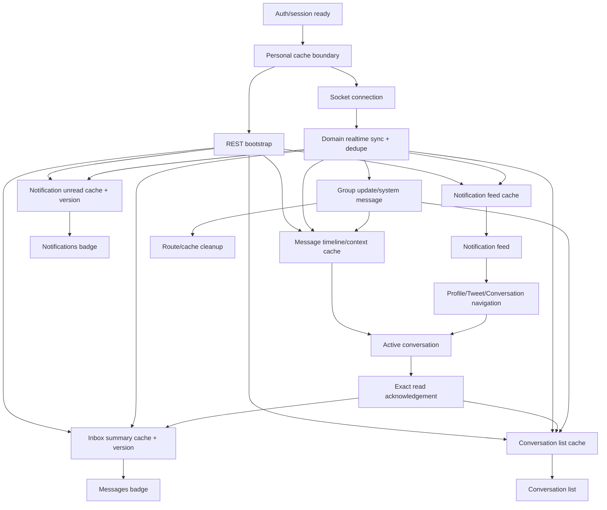

# Kế hoạch triển khai Frontend Notification, Unread và Realtime

Tài liệu này là kế hoạch triển khai frontend dựa trên source hiện tại. Không có source code nào được sửa trong bước lập kế hoạch này.

## Nguồn chân lý và giới hạn xác minh

- Hiện trạng: source trong `X-frontend/src`.
- Yêu cầu sản phẩm/UX: `input-frontend-noti.md`.
- Quy tắc kỹ thuật/UI: `AI_RULES.md`, `architecture.md`, `design-system.md`.
- Bản đồ hỗ trợ: `frontend-noti-review.md`; mọi kết luận quan trọng đã được kiểm tra lại với source.
- Bối cảnh nghiệp vụ backend: `../X-ver2/input-noti.md`.
- Repo không có file tên `notification-backend-contract.md`. Contract backend khả dụng và đã được đọc đầy đủ là `../X-ver2/frontend-notification-contract.md`. Kế hoạch dùng file này làm contract hiện hành, đồng thời ghi nhận việc thiếu đúng tên tài liệu trong Gap matrix.

Đã xác minh lại rằng source frontend không thay đổi so với các phát hiện cốt lõi trong review: không có notification feature/route, không có unread types/query/listener/badge, `markAsRead` không được gọi, `/messages` đang render Home page, system message chưa có branch, và logout không clear personal React Query caches.

## 1. Mục tiêu cuối cùng

Sau khi hoàn thành toàn bộ kế hoạch, frontend phải có trạng thái sau:

- Notification tab tải bằng REST, phân trang cursor, render toàn bộ type backend có thể trả, có read/unread, aggregate, unavailable state, mark one/read all và điều hướng an toàn.
- Badge Notifications dùng notification unread state/version của backend; badge Messages dùng `unread_conversation_count`, tuyệt đối không dùng tổng message hoặc số row đã tải.
- Sidebar desktop và navigation mobile dùng chung state, có `99+`, loading, reconnect status và accessible label.
- Conversation list hiển thị unread từng conversation, preview/timestamp mới nhất, mute/pin và cập nhật realtime không tạo duplicate.
- Active conversation chỉ gửi read acknowledgement khi message thực sự đủ điều kiện được xem; hidden tab hoặc user đang đọc đoạn cũ không bị auto-mark read.
- Message send dùng `client_message_id` ổn định, retry idempotent, consume `message_id` acknowledgement và không append duplicate.
- Reply, group mention và reaction đồng bộ giữa Chat, Inbox và Notification theo đúng phân loại delivery của backend.
- Group system message có presentation riêng, không có action user-message; kick/leave/admin transfer dọn route/cache đúng invariant một admin.
- Socket chỉ là incremental transport. Initial load, reconnect, regain focus và recovery luôn đối soát bằng REST; mọi item/state event được dedupe theo ID/version.
- Notification, conversation và message là React Query server state. Zustand chỉ giữ auth và UI intent/draft; không tạo bản sao server state.
- Logout/account switch xóa toàn bộ personal caches và reset UI stores để không rò dữ liệu phiên trước.
- Không thêm package, không fake field, không sửa backend trong các phase frontend chính, không tạo migration/test-data compatibility logic.

Các UX bị backend chặn vẫn có fallback an toàn và nằm riêng trong Backend gaps/phase phụ có điều kiện. Toàn hệ thống chỉ được coi đạt đầy đủ yêu cầu khi các gap được xác nhận là không bắt buộc hoặc phase phụ tương ứng đã hoàn tất.

## 2. Hiện trạng đã xác minh

### Socket

- `src/providers/socket-provider.tsx` sở hữu connection/auth reconnect và expose `{socket,isConnected}`.
- Provider đang gọi trực tiếp `useConversationSocketSync`, tạo coupling global-provider/domain.
- Listener global hiện có: group update, receive message, history cleared.
- Listener chỉ mount trong active chat: conversation error, message revoked, deleted-for-me, reaction-updated.
- Không nghe bất kỳ `@notification:*` hoặc `@conversation:read-state` event nào.
- `connect` chỉ đổi boolean; không invalidate/refetch sau reconnect. `refetchOnWindowFocus` toàn app đang là `false`.

### Auth

- Zustand persist `user/isAuthenticated`; cookies giữ access/refresh token.
- Login gọi `setAuth(null as any, ...)`, tạo khoảng thời gian authenticated nhưng user null.
- `AuthInitializer` fetch `/user/me`, nhưng không expose initializing/error state.
- Logout xóa cookie/Zustand nhưng không clear QueryClient, conversation detail/composer store hoặc reopen markers.

### API

- Có `apiClient` với Bearer interceptor và single-flight refresh.
- `conversationsApi` có list/messages/context/reaction/group lifecycle và một `markAsRead` body rỗng/type `{success}` chưa dùng.
- Không có notification API, unread-summary API hoặc follow-post preference API ở frontend.
- Message context endpoint thực tế tồn tại ở cả frontend và backend: `/conversations/:conversation_id/messages/:message_id/context`.

### Chênh lệch đã ghi nhận so với review

- `frontend-noti-review.md` thận trọng coi fetch-around message là gap vì notification handoff không mô tả endpoint. Kiểm tra source xác nhận cả frontend `conversationsApi.getMessageContext` và backend `conversation.route.ts` đều đã có endpoint context; kế hoạch coi đây là capability tái sử dụng, không phải backend blocker.
- Review ghi mute là contract gap theo riêng notification handoff. Kiểm tra backend source xác nhận có `muted_by` và mute/unmute routes đang được frontend dùng; kế hoạch giữ nguyên capability hiện có, chỉ không mở rộng mute semantics ngoài contract.
- Các kết luận còn lại của review khớp source hiện tại; source vẫn được ưu tiên nếu code thay đổi khi bắt đầu từng phase.

### Cache

- React Query dùng `['conversations']`, `['messages', id]` và nhiều key prefix rải rác.
- Revoke/delete/reaction có cache helpers tương đối tốt; receive message dedupe theo `_id` và patch conversation preview.
- Không có versioned unread caches.
- Personal cache không scoped/reset theo session.

### Store

- `auth.store.ts`: session projection.
- `conversation-details.store.ts`: details view và message focus target.
- `message-composer.store.ts`: reply draft.
- Không có notification store; đây là đúng điểm khởi đầu vì notification nên là server state, không phải lý do để thêm Zustand.

### Sidebar

- Có link `/notifications` và `/messages`, icon active/idle.
- Không có badge, loading/reconnect state hoặc mobile navigation.
- Sidebar bị ẩn dưới `sm`.

### Conversation/message

- Conversation list, search, mute/pin, direct/group, ChatWindow, cursor pagination, reply context, reactions và group leave/atomic transfer đã có.
- `Conversation` thiếu `unread_message_count`, `last_read_message_id`, `last_read_at`.
- `Message` vẫn required `read_by`, thiếu `kind`, system fields, mention IDs và client message ID.
- Conversation row không có unread presentation và dùng clickable `div` không keyboard semantic.
- MessageList không ack read, không xét tab visibility và không có new-message pill khi đang đọc đoạn cũ.
- System message sẽ đi qua user-message branch và có thể hiện action backend cấm.

### Notification/unread

- Không có `src/features/notifications`.
- Không có route `/notifications`.
- Không có notification types/API/query keys/hooks/components/socket sync.
- Không có unread-summary query hoặc hai global badge.

## 3. Quyết định kiến trúc

### Source of truth

| State | Source of truth | Frontend owner |
| --- | --- | --- |
| Notification feed | `GET /api/notifications` | React Query infinite cache |
| Notification unread | `GET /api/notifications/unread-count`, mutation responses và socket state có `version` | React Query query riêng; không tính từ feed |
| Conversation list + unread từng row | `GET /api/conversations` | React Query `conversations` cache |
| Inbox summary | `GET /api/conversations/unread-summary` và `@conversation:read-state` | React Query query riêng |
| Message timeline/context | Message REST + committed socket events | React Query infinite/context caches |
| Active conversation | URL `/messages/:conversationId` | Next.js route; không thêm active-conversation store |
| Focus target message | UI intent | Giữ `conversation-details.store.ts` |
| Reply/pending UI intent | UI draft | Zustand/local state, reset theo session/conversation |
| Socket connection | Socket.IO client state | Giữ `SocketProvider` Context |
| Group membership/role | Conversation/member APIs | React Query conversation + members projections |

### REST bootstrap

- Badge queries mount sau khi session đã đủ điều kiện authenticated.
- Notification route mount infinite feed query; Inbox mount conversation list; active route mount message query.
- Feed/list count không được seed bằng số item đang cache.
- Notification feed `unreadCount` không có version nên không được ghi đè một unread state đã version hóa; unread endpoint/mutation/socket là nguồn badge.

### Socket incremental update

- Domain listeners mount đúng một lần dưới một realtime composition provider, không phụ thuộc route trừ hành vi điều hướng thật sự cần route.
- Notification item event upsert/remove theo `_id`; count state áp dụng theo `version`.
- Message receive upsert theo `_id`; optimistic send còn đối soát bằng `client_message_id/message_id`.
- Read-state là authoritative snapshot, không phải delta.
- Reaction event chỉ patch reaction cache; không tự tạo Notification row.

### Reconnect reconciliation

- Mỗi connect/reconnect và browser regain focus invalidate/refetch các query đang active: notification unread, notification page đầu, inbox summary, conversations và active message data cần thiết.
- Không polling định kỳ.
- Giữ cache/draft trong thời gian disconnect; UI hiển thị syncing/reconnecting nhưng không reset count về 0.

### Query/cache/store ownership

- Tạo query-key factory theo feature; cache helpers dùng factory, không hard-code string mới.
- Không tạo Zustand notification store hoặc unread store.
- Zustand chỉ thêm reset action cho các UI stores hiện có và pending-send UI nếu thật sự cần bền qua component rerender.
- Server payload raw được normalize bằng typed helper thuần túy; không thêm field giả vào backend DTO. Client-only pending state phải là type riêng, không giả làm committed `Message`.

### Deduplication phía client

- Notification: `_id`; không merge hai aggregate window khác `_id`.
- Message: `_id`; pending send dùng `client_message_id`, ack dùng `message_id`.
- Count/read summary: `version`; event cũ/trùng không tạo delta.
- Pagination: merge theo ID, giữ cursor opaque và canonical order.
- Socket listener: `on`/`off` cùng handler, một domain sync instance.

### Badge semantics

- Notifications: unread notification item; aggregate nhiều actor vẫn một item.
- Messages: `unread_conversation_count`; không dùng `total_unread_message_count`.
- `0` ẩn badge, `1..99` hiện chính xác, `>=100` hiện `99+`; aria label đọc số thật.

### Navigation

- Follow -> profile actor còn hydrate.
- Social target -> tweet target; reply/mention dùng parent context khi có thể focus an toàn, fallback mở target child.
- Directed message/reaction -> route conversation rồi dùng existing `focusMessage` + message context query.
- Group kick/target null -> không mở group; cleanup cache/route.
- Target/actor null -> unavailable state, không khôi phục từ cache redacted.

### Listener lifecycle

- `SocketProvider` chỉ giữ connection/auth.
- `RealtimeSyncProvider` hoặc component tương đương compose notification/conversation/message lifecycle hooks dưới SocketProvider.
- Global cache events không mount trong `ChatWindow`.
- Route-dependent redirect dùng current pathname/router trong conversation group sync, với cleanup khi pathname đổi.

### Logout cleanup

- Một session boundary quan sát authenticated/user identity transition.
- Logout hoặc account identity đổi phải cancel/clear personal React Query caches, reset conversation detail/composer/pending state, clear reopen markers và ngắt socket qua auth state hiện có.
- Hard reload do Axios refresh failure tự xóa memory, nhưng vẫn giữ cleanup explicit cho logout bình thường.

### Dependency map

Quan hệ triển khai bắt buộc: contract/session foundation -> realtime state engine -> badge/navigation/feed -> Inbox unread -> active read -> directed/system behaviors -> cross-surface hardening.

## 4. Contract matrix

| Backend endpoint/event | Frontend state | Hook/store/query | Component ảnh hưởng | Hành động |
| --- | --- | --- | --- | --- |
| `GET /api/notifications?limit&cursor` | Notification pages | `notificationKeys.feed`, `useNotifications` | NotificationFeed | Infinite load, merge `_id`, giữ order/cursor opaque. |
| `GET /api/notifications/unread-count` | Notification unread snapshot | `notificationKeys.unread` | Sidebar badges/feed header | Bootstrap/reconcile `{unreadCount,version,updated_at}`. |
| `POST /api/notifications/:id/read` | Item read + unread snapshot | `useMarkNotificationRead` | NotificationItem | Optimistic có rollback hoặc commit theo response; badge dùng response version. |
| `POST /api/notifications/read-all` | Cached read state + unread snapshot | `useMarkAllNotificationsRead` | NotificationPage | Apply safe cached rows; concurrent activity thì refetch page đầu/count. |
| `@notification:new` | Raw notification event | `useNotificationSocketSync` + raw-event reducer | Feed/toast | Dedupe `_id`, không cast raw thành hydrated row, không cộng count; invalidate/refetch hydration/page đầu. |
| `@notification:unread-count` | Notification unread | Cùng sync hook | Notifications badge | Chỉ apply version mới hơn. |
| `@notification:read-state` | Read item(s) + unread | Cùng sync hook | Feed/badge | Mark-one exact; read-all invalidate nếu cutoff không xác định; replace count/version. |
| `@notification:updated` | Raw aggregate event | Cùng sync hook | Aggregate row | Ghi nhận event theo `_id`, invalidate hydrated row/page; không đổi badge và không giữ actor projection cũ như truth. |
| `@notification:removed` | Feed item + optional unread | Cùng sync hook | Feed/badge | Remove exact ID; apply non-stale version hoặc refetch count. |
| `GET /api/conversations` | List + per-row unread/read position | `conversationKeys.list`, `useConversations` | Inbox/Chat/details | Bootstrap authoritative row state. |
| `GET /api/conversations/unread-summary` | Inbox summary/version | `conversationKeys.unreadSummary` | Messages badge | Bootstrap/reconnect; badge dùng conversation count. |
| `POST /api/conversations/:id/read` | Read position + row/summary | `useConversationRead` | Active chat/list/badge | Gửi exact visible `message_id`; apply full response atomically. |
| Client `@conversation:read` ack | Như REST read | `useConversationRead` | Active chat | Primary fast path hoặc fallback policy duy nhất, không gửi trùng vô ích. |
| `@conversation:read-state` | Authoritative row + summary | Conversation realtime sync | List/badge/active chat | Apply version không cũ; update row và summary trong một cache transaction. |
| `GET /api/conversations/:id/messages` | Message timeline | `conversationKeys.messages` | MessageList | Cursor pagination, dedupe `_id`. |
| `GET /api/conversations/:id/messages/:messageId/context` | Target message window | Existing focus store/context hook | Message deep-link | Load, focus/highlight target; 403/404 -> unavailable/cleanup. |
| Client `@conversation:send` + ack | Pending/committed send | `useChatSocket` + pending UI state | MessageInput/MessageList | Stable `client_message_id`, retry same payload, consume `message_id`. |
| `@conversation:receive` | Message + conversation preview | Conversation realtime sync | Chat/Inbox | Upsert `_id`, update preview/order; unread chờ read-state. |
| `@message:reaction-updated` | Message reactions | Existing message cache helpers | MessageBubble | Replace authoritative reactions; no Inbox unread delta. |
| `@message:revoked`, `@message:deleted-for-me` | Message/lifecycle caches | Existing helpers moved global | Chat/Inbox | Patch/remove projections, invalidate preview, clear target/reply. |
| `@conversation:history-cleared` | Conversation-scoped caches | Existing conversation sync | Chat/Inbox | Remove scoped data, close route/details. |
| `@conversation:group-updated` | Conversation/member/membership | Conversation realtime sync | Group UI/route | Invalidate/refetch; current user departure -> remove caches/route. |
| System message qua `@conversation:receive` | Message timeline/unread | Message types/realtime sync | SystemMessageRow/Inbox | Render activity row, không user actions; unread theo read-state. |
| `PATCH /api/user/:id/follow-notification-preferences` | Follow-post preference mutation | User service/mutation | Profile follow controls | Chỉ update sau state bootstrap có thẩm quyền; response `{followed_user_id,posts}`. |
| `connect`/browser focus | Reconciliation trigger | RealtimeSyncProvider | Toàn bộ surfaces | Invalidate/refetch active personal queries, không polling. |
| Logout/account switch | Personal state boundary | QueryClient + UI store resets | Toàn app | Cancel/clear cache và local sensitive state. |

## 5. Gap matrix

| Phân loại | Gap đã xác minh | Xử lý trong kế hoạch |
| --- | --- | --- |
| Frontend thiếu | Notification feature/route/feed/API/types/query/listeners | Phase 1, 2, 4 |
| Frontend thiếu | Hai unread summaries/badges | Phase 1, 2, 3 |
| Frontend thiếu | Inbox landing/mobile navigation/unread row | Phase 3, 5 |
| Frontend thiếu | Active visibility read semantics | Phase 6 |
| Frontend thiếu | Client idempotent send/mention highlight | Phase 7 |
| Frontend thiếu | System message branch và group change types mới | Phase 8 |
| Technical debt | Personal cache không clear logout/account switch | Phase 1 |
| Technical debt | Provider phụ thuộc domain; lifecycle listeners chỉ mount trong chat | Phase 2 |
| Technical debt | Query keys hard-code rải rác | Chỉ centralize các key bị chạm ở Phase 1/2; không refactor toàn dự án |
| Technical debt | `/messages` render Home, mobile thiếu Inbox/nav | Phase 3/5 |
| Technical debt | `any`, `read_by` legacy, response types cũ | Chỉ sửa type liên quan trong Phase 1/7; không dọn lint toàn repo |
| Backend thiếu | Raw notification socket không hydrate và không có fetch-by-ID | Fallback refetch trong Phase 2/4; Phase 4.1 nếu rich realtime là gate |
| Backend thiếu | `GET /conversations` không có last-message sender projection cho group | Fallback không prefix hoặc dùng data có sẵn; Phase 5.1 để hoàn thiện bền vững |
| Backend thiếu | Không có API đọc current `posts` preference của follow relation | Không fake toggle; Phase 9.1 có điều kiện |
| Backend thiếu | Notification target không có media thumbnail | Text preview; không chặn core feed |
| Backend thiếu | Không có participant read receipts | Không hiển thị “Đã xem bởi”; ngoài core unread scope |
| Backend thiếu | System message không bảo đảm actor/affected-user projections | Dùng backend `content`/copy trung tính; không dựng tên từ ID |
| Backend thiếu | Không có public reason code cho target/actor null | Unavailable copy trung tính |
| Contract không rõ | File `notification-backend-contract.md` không tồn tại | Dùng contract khả dụng; phải xác nhận trước khi triển khai Phase 1 |
| Contract không rõ | Notification handoff không mô tả mute/message-context dù backend source có route/data | Giữ capability hiện có; không thay contract dựa trên suy đoán |
| Không thuộc phạm vi | Push notification, migration/backfill, test-account automation | Không đưa vào phase frontend chính |
| Không thuộc phạm vi | Refactor toàn auth/tweet/media/search hoặc làm sạch toàn bộ lint | Chỉ chạm boundary trực tiếp cần thiết |

## 6. Kế hoạch theo phase

### Phase 1 — Contract-safe data layer và session boundary

**Trạng thái: Đã hoàn thành.**

**Mục tiêu**

Tạo nền type/API/query-key đúng contract và bảo đảm personal server state được xóa khi session kết thúc. Phase này chưa render badge/feed và chưa gắn notification listener.

**Phạm vi**

- Notification DTO/type union, public actor/target projections, context narrowing, REST response types.
- Notification API methods và query-key factory.
- Conversation unread summary/read response types và API methods.
- Additive Message/Conversation/GroupUpdated types theo backend hiện tại; `read_by` chuyển optional compatibility, không dùng cho unread.
- Loại `setAuth(null as any)` bằng login/bootstrap typed có attempt ID: chỉ attempt hiện hành được ghi token, hoàn tất hoặc fail session sau khi `/user/me` trả `User` thật.
- Session cache boundary: clear QueryClient và reset UI stores/reopen markers khi logout hoặc user identity đổi.
- Session-ready selector chặn conversation/message queries và socket trong lúc auth đang initializing.

**Phụ thuộc**

- Xác nhận `../X-ver2/frontend-notification-contract.md` chính là contract được gọi bằng tên `notification-backend-contract.md`.
- Không phụ thuộc phase frontend khác.

**Hiện trạng liên quan**

- Không có notification feature.
- `conversationsApi.markAsRead` body/type cũ và unused.
- Query keys conversations mới chỉ centralize list/messages.
- Logout không clear cache/store.

**Backend contract sử dụng**

- Bốn notification REST endpoints.
- `GET /conversations`, `/conversations/unread-summary`, `POST /conversations/:id/read`.
- Additive message fields, notification types/targets/context và group change types.

**File tạo mới**

- `src/features/notifications/types/notification.type.ts`
- `src/features/notifications/api/notifications.api.ts`
- `src/features/notifications/constants/notification-query-keys.ts`
- `src/features/conversations/types/conversation-unread.type.ts`
- `src/features/auth/utils/auth-user.ts`
- `src/providers/personal-session-boundary.tsx`

**File sửa**

- `src/features/conversations/types/index.ts`
- `src/features/conversations/types/group-action.type.ts`
- `src/features/conversations/api/conversations.api.ts`
- `src/features/conversations/constants/conversation-query-keys.ts`
- `src/features/conversations/hooks/use-conversations.ts`
- `src/features/conversations/hooks/use-messages.ts`
- `src/features/conversations/stores/conversation-details.store.ts`
- `src/features/conversations/stores/message-composer.store.ts`
- `src/features/conversations/utils/conversation-reopen-state.ts`
- `src/providers/app-provider.tsx`
- `src/features/auth/stores/auth.store.ts`
- `src/features/auth/api/auth.service.ts`
- `src/features/auth/components/login-form.tsx`
- `src/providers/auth-initializer.tsx`
- `src/providers/socket-provider.tsx`
- `src/services/api.client.ts`

**Type/API/store/hook/component**

- Type: làm đầy đủ; không `any`, actor info array cho phép entry null theo backend DTO thực tế.
- API: typed envelope/data; cursor truyền nguyên chuỗi; read nhận optional `message_id`.
- Store: thêm auth attempt/initializing transition typed, session-ready selector và reset action cho UI stores; không tạo server-state store.
- Hook/component: chỉ gate các query/socket cá nhân hiện có bằng session-ready; chưa tạo notification data hook hay UI ngoài session boundary.

**Luồng dữ liệu sau phase**

Contract DTO -> typed service -> query keys sẵn cho phase sau. Auth attempt hiện hành -> hydrate user -> mở personal queries/socket. Auth transition kết thúc/đổi identity -> cancel/clear QueryClient -> reset details/composer/reopen markers.

**Socket và cache behavior**

Chưa đổi listener domain behavior. Socket chỉ connect khi session ready. Cache cleanup không chạy nhầm ở initial Zustand hydration; chỉ chạy khi session authenticated thực sự kết thúc hoặc identity đổi.

**UI states**

Không có UI mới. Existing UI không được regress khi additive field chưa được dùng.

**Edge cases**

- Persisted state cũ hoặc login đang initializing có `user=null`; personal queries/socket không được coi session này là ready.
- Logout API lỗi nhưng local logout vẫn chạy.
- Refresh-token hard redirect.
- Account A logout rồi account B login trong cùng tab.
- Bootstrap A hoàn tất/fail muộn sau khi login B bắt đầu: attempt A bị bỏ qua, không ghi đè user/token hoặc logout B.
- Refresh request được key theo refresh token khởi tạo; response token cũ không ghi đè cookie đã chuyển session.
- Legacy message thiếu `kind`, `client_message_id`, `mention_user_ids`, `read_by`.

**Những việc không làm**

- Không render Notification/Badge.
- Không refactor toàn auth service hoặc mọi query key trong dự án.
- Không tạo local fallback count.

**Kiểm tra TypeScript**

- Bắt buộc: `npx tsc --noEmit`.
- Nên chạy ESLint chỉ trên file tạo/sửa; không lấy lỗi lint sẵn có ngoài phạm vi làm gate.

**Gate hoàn thành**

- Tất cả contract types/API compile và không có `any` mới.
- Login không còn `null as any`; `isAuthenticated=true` chỉ đi cùng current user đã hydrate.
- Auth completion/failure cũ không thể ghi đè hoặc xóa session mới; personal queries/socket chỉ chạy khi session ready.
- Existing messaging compile với legacy/additive message fields.
- Logout/account switch test bằng unit-level inspection cho thấy personal query cache và UI stores được reset; không cần AI tạo tài khoản/runtime.
- Không có UI behavior thay đổi ngoài cleanup session.

**Điều kiện mở Phase 1.1**

Mở nếu contract đúng tên được cung cấp sau đó khác endpoint/event/shape so với file đang dùng, hoặc request thật chứng minh response không khớp. Phase 1 không được đánh dấu hoàn thành cho tới khi contract identity được xác nhận nếu khác biệt ảnh hưởng type/API gate.

**Rollback đơn giản**

Các module notification mới chưa có consumer nên có thể remove; revert additive method/type và unmount session boundary. Không động dữ liệu/backend.

### Phase 2 — Realtime sync, versioning và reconciliation foundation

**Trạng thái: Đã hoàn thành.**

**Mục tiêu**

Thiết lập một lifecycle listener duy nhất cho notification/conversation/message state, có version/dedupe, reconnect/focus reconciliation và không phụ thuộc active route cho cache events toàn cục.

**Phạm vi**

- Tách domain sync invocation khỏi connection-only SocketProvider.
- Notification cache reducer cho new/count/read/updated/removed.
- Conversation read-state reducer cập nhật row/summary atomically.
- Chuyển revoke/delete/reaction listeners từ active chat sang global conversation sync; giữ send/error/typing trong chat hook.
- Reconcile active personal queries khi connect/reconnect/focus.

**Phụ thuộc**

- Phase 1 hoàn thành.

**Hiện trạng liên quan**

- Provider đang import conversation hook.
- Listener notification/read-state không có.
- Reconnect chỉ set boolean.
- Message lifecycle listeners chỉ tồn tại khi ChatWindow mount.

**Backend contract sử dụng**

- Toàn bộ `@notification:*` events.
- `@conversation:receive`, `@conversation:read-state`, `@conversation:group-updated`.
- Existing `@message:revoked`, `@message:deleted-for-me`, `@message:reaction-updated`, history-cleared.

**File tạo mới**

- `src/features/notifications/utils/notification-cache.ts`
- `src/features/notifications/hooks/use-notification-socket-sync.ts`
- `src/providers/realtime-sync-provider.tsx`

**File sửa**

- `src/providers/socket-provider.tsx`
- `src/app/layout.tsx`
- `src/features/conversations/hooks/use-conversation-socket-sync.ts`
- `src/features/conversations/hooks/use-chat-socket.ts`
- `src/features/conversations/utils/conversation-cache.ts`
- Query-key files từ Phase 1 nếu cần helper invalidate page đầu/summary.

**Type/API/store/hook/component**

- Type: socket payload interfaces exact; no wrapper cho raw notification.
- API: không gọi trực tiếp trong listener; dùng QueryClient invalidate/refetch hooks.
- Store: chỉ dùng `getState` để cleanup UI target khi conversation/message mất quyền.
- Hook: domain sync hooks mount một lần.
- Component: RealtimeSyncProvider là composition, không render UI.

**Luồng dữ liệu sau phase**

Socket event -> typed reducer -> upsert/remove/version compare trong React Query -> invalidate projection thiếu hydration. Connect/focus -> invalidate active REST sources -> merge authoritative response.

**Socket và cache behavior**

- `@notification:new`: dedupe raw event theo ID, invalidate page đầu để hydrate; không chèn/cast raw payload vào cache page typed là hydrated và không đổi badge.
- unread-count: chỉ apply version mới hơn.
- read-state: item read + exact count/version; read-all thiếu cutoff -> invalidate feed head.
- updated: invalidate hydrated aggregate theo ID/page, không đổi count; chỉ patch field an toàn nếu cache model tách rõ raw và hydrated.
- removed: remove ID, apply optional non-stale version, thiếu version -> invalidate unread.
- conversation read-state: apply version không cũ hơn; row + summary cùng transaction.
- Duplicate event không tạo side effect lần hai.

**UI states**

Chưa render UI mới. Existing `isConnected` vẫn hoạt động. Không toast mọi event.

**Edge cases**

- Item event và count event đảo thứ tự.
- Reactivation giữ `_id` cũ.
- Read-all đồng thời có notification mới.
- Multi-tab nhận cùng event.
- Socket disconnect lâu rồi reconnect.
- Event tới khi query chưa từng mount.
- User bị kick khi không ở Chat route.

**Những việc không làm**

- Không tạo delta count.
- Không polling.
- Không hydrate actor/target từ ID/cache cũ.
- Không render feed/badge.

**Kiểm tra TypeScript**

- Bắt buộc: `npx tsc --noEmit`.
- Targeted lint cho provider/sync/cache files.

**Gate hoàn thành**

- Mỗi listener có cleanup cùng handler và chỉ một registration tree.
- Payload duplicate/out-of-order không tăng/giảm count sai.
- Reconnect/focus có explicit REST invalidation path.
- Existing receive/revoke/delete/reaction/group cleanup không regress về cache semantics.

**Điều kiện mở Phase 2.1**

Không dự kiến Phase 2.1 riêng. Raw notification hydration là blocker của feed UX và được mô tả ở Phase 4.1, sau khi có UI để đo ảnh hưởng.

**Rollback đơn giản**

Có thể mount lại existing `useConversationSocketSync` trong SocketProvider và trả message lifecycle listeners về `useChatSocket`; notification modules chưa có UI consumer.

### Phase 3 — Responsive navigation và hai badge versioned

**Trạng thái: Chưa triển khai.**

**Mục tiêu**

Hiển thị đúng Notifications badge và Messages badge trên desktop/mobile, dùng REST bootstrap và realtime state foundation.

**Phạm vi**

- Query hooks cho notification unread và inbox summary.
- Generic count badge nhỏ, semantic đúng.
- Extend Sidebar hiện tại; thêm mobile navigation dùng cùng item/state.
- Loading, cached refetch, zero, 99+, disconnected/reconnecting state.

**Phụ thuộc**

- Phase 1 và 2.

**Hiện trạng liên quan**

- Sidebar item map có sẵn, icon active/idle.
- Không có badge/mobile nav.
- Main layout chưa chừa bottom safe area.

**Backend contract sử dụng**

- `GET /notifications/unread-count`.
- `GET /conversations/unread-summary`.
- Count/version updates đã xử lý ở Phase 2.

**File tạo mới**

- `src/features/notifications/hooks/use-notification-unread-count.ts`
- `src/features/conversations/hooks/use-conversation-unread-summary.ts`
- `src/components/ui/count-badge.tsx`

**File sửa**

- `src/components/layout/sidebar.tsx`
- `src/app/(main)/layout.tsx`
- Có thể `src/app/globals.css` chỉ cho safe-area token, không đổi design toàn app.

**Type/API/store/hook/component**

- Type/API: dùng Phase 1.
- Store: không thêm.
- Hook: React Query, enabled theo session hợp lệ.
- Component: badge presentational; Sidebar/mobile nav consume hook state.

**Luồng dữ liệu sau phase**

REST bootstrap -> unread query caches -> badge. Socket reducers Phase 2 -> cùng caches -> mọi navigation surface rerender.

**Socket và cache behavior**

Không đăng ký listener trong Sidebar. Refetch giữ count cache cũ; socket disconnected không reset state.

**UI states**

- First load: stable placeholder/skeleton, không fake 0.
- Cached refetch: giữ count + syncing state kín đáo.
- 0: ẩn visual badge.
- >=100: `99+`, aria đọc số thật.
- Disconnect kéo dài: shared reconnect indication, icons vẫn dùng được.

**Edge cases**

- Aggregate có 100 actors vẫn count một item.
- Một conversation từ 1 lên nhiều unread không tăng Messages badge lần hai.
- Version cũ tới sau REST mới.
- Desktop/mobile breakpoint không tạo state thứ hai.

**Những việc không làm**

- Không dùng feed length/conversation rows để tính badge.
- Không dùng total unread messages cho Messages icon.
- Không tạo notification route trong phase này.

**Kiểm tra TypeScript**

- Bắt buộc: `npx tsc --noEmit`.
- Targeted lint cho badge/sidebar/layout/hooks.

**Gate hoàn thành**

- Hai badge đúng source/semantics trên desktop/mobile.
- Loading/zero/99+/disconnect/aria state có thể kiểm tra bằng component state mà không cần account test do AI tạo.
- Sidebar không đăng ký socket listener và không chứa business reducer.

**Điều kiện mở Phase 3.1**

Mở nếu unread endpoint thực tế thiếu `version` hoặc shape khác contract. Cần dừng gate count ordering, cung cấp response evidence và không thay bằng local delta.

**Rollback đơn giản**

Remove badge/hooks/mobile nav và trả Sidebar markup cũ; foundation cache/listener vẫn vô hại.

### Phase 4 — Durable Notification feed, read actions và safe navigation

**Trạng thái: Chưa triển khai.**

**Mục tiêu**

Tạo Notification tab hoàn chỉnh trên REST, hưởng realtime cache sync đã có, render đúng mọi backend type mà không tự gom/fake target.

**Phạm vi**

- Thin route `/notifications`.
- Infinite feed, skeleton/empty/error/pagination retry.
- Item layout, actor/aggregate/target preview, read/unread/unavailable states.
- Type-to-copy/navigation mapping cho social, directed message, group và compatibility types.
- Mark one/read all, exact badge/version update.
- Message target dùng existing focus store/context route.

**Phụ thuộc**

- Phase 1–3.

**Hiện trạng liên quan**

- Route/link có link nhưng page không tồn tại.
- Tweet/profile/message routes có sẵn; message focus/context đã có.
- Không có compact tweet/notification item component.

**Backend contract sử dụng**

- Notification feed/read endpoints.
- Actor/target projections và context.
- All current notification types: `follow`, `followed_user_tweet`, `like`, `retweet`, `quote`, `reply`, `mention`, `message_reply`, `message_mention`, `message_reaction`, compatibility `message`, group types và `system`.

**File tạo mới**

- `src/app/(main)/notifications/page.tsx`
- `src/features/notifications/hooks/use-notifications.ts`
- `src/features/notifications/hooks/use-notification-actions.ts`
- `src/features/notifications/components/notification-page.tsx`
- `src/features/notifications/components/notification-feed.tsx`
- `src/features/notifications/components/notification-item.tsx`
- `src/features/notifications/components/notification-actor.tsx`
- `src/features/notifications/components/notification-target-preview.tsx`
- `src/features/notifications/utils/notification-presentation.ts`
- `src/features/notifications/utils/notification-navigation.ts`

**File sửa**

- Notification cache helpers Phase 2 nếu feed page shape cần merge.
- `src/features/conversations/stores/conversation-details.store.ts` chỉ nếu navigation helper cần một atomic focus intent đã có sẵn.

**Type/API/store/hook/component**

- Type/API: Phase 1.
- Store: reuse focus store; không notification store.
- Hook: infinite query và typed mutations.
- Component: FSD trong notifications; route chỉ wrapper.

**Luồng dữ liệu sau phase**

Route -> REST page -> render. Socket raw item -> reducer/invalidate -> hydrated REST merge -> render. Mark action -> response version/count -> item/cache/badge -> cross-tab read-state reconcile.

**Socket và cache behavior**

- Không đăng ký listener ở page.
- Pagination merge `_id`, canonical order `created_at + _id`.
- Updated aggregate không prepend/reorder theo `updated_at`.
- Removed item mất khỏi mọi page.
- Page unmount không làm mất global unread state.

**UI states**

- Initial skeleton đúng row shape; pagination loading riêng.
- Empty khác error; initial/pagination error có retry.
- Unread không chỉ dùng màu.
- Actor/target null: placeholder/copy trung tính, CTA disabled.
- Aggregate avatars tối đa projection backend, count text đúng.
- Mark-all pending/disabled và concurrent new item vẫn unread.

**Edge cases**

- Legacy follow target null nhưng actor hydrate.
- `actor_infos_preview` có null entry.
- Reactivation `_id` cũ.
- Aggregate đọc đóng window; window mới khác ID.
- Target bị delete/block/redact giữa click và navigation.
- Group kick target null.
- Unknown type fallback không route giả.
- Click unread: mark lỗi không chặn safe navigation.

**Những việc không làm**

- Không thumbnail nếu backend không có field.
- Không Follow Back nếu không có relationship state authoritative.
- Không tự tạo generic message notification.
- Không tự aggregate.

**Kiểm tra TypeScript**

- Bắt buộc: `npx tsc --noEmit`.
- Targeted lint cho feature/route mới.

**Gate hoàn thành**

- Feed REST/pagination/read actions/type renderer hoạt động theo typed fixtures/inspection.
- Tất cả current backend type có presentation và safe navigation/fallback.
- Badge chỉ thay đổi từ authoritative versioned state.
- Không có `any`, fake DTO field hoặc route từ redacted ID.

**Điều kiện mở Phase 4.1**

Mở khi nghiệm thu yêu cầu rich realtime cho thấy raw event + page-one refetch không thể hydrate item kịp thời/đúng vị trí, đặc biệt reactivation cũ không nằm ở page đầu. Phase 4 vẫn hoàn thành phần durable REST; capability realtime rich item bị đánh dấu partial.

**Rollback đơn giản**

Remove route/notification UI/hooks; badges/realtime foundation tiếp tục hoạt động độc lập.

#### Phase 4.1 — Hydrated realtime notification contract (chỉ mở khi có blocker)

**Trạng thái: Chưa triển khai.**

- **Vấn đề phát hiện:** `@notification:new`/`updated` không đủ actor/target projection và không có endpoint fetch một item.
- **Nguyên nhân:** Backend delivery gọi `toPublicNotification` trên raw document; hydration chỉ nằm trong list query service.
- **Bằng chứng từ code:** `X-ver2/src/modules/notification/notification-delivery.service.ts` emit raw document; `notification-query.service.ts` mới gắn `actor_info`, `actor_infos_preview`, `target_info`; `notification.route.ts` không có `GET /:id`.
- **Ảnh hưởng:** Feed có thể phải hiện placeholder/refetch; reactivation/item không ở page đầu không thể hydrate đúng, rich toast realtime bị chặn.
- **Phần Phase 4 đã hoàn thành:** Durable REST feed, read actions, safe fallback, ID/version reducer và page-one reconciliation.
- **Phần còn bị chặn:** Rich item/toast ngay lập tức và deterministic hydration cho một notification bất kỳ.
- **Backend file/endpoint/event cần sửa:** `notification-delivery.service.ts`, `notification-query.service.ts`, `notification.controller.ts`, `notification.route.ts`; chọn hydrated socket payload hoặc `GET /api/notifications/:id` có cùng redaction policy.
- **Contract đích sau sửa:** Một nguồn trả đúng public projections như list, không lộ actor/target bị block/deleted; item vẫn dedupe bằng `_id`, count event tách riêng.
- **Frontend file cần cập nhật:** `notifications.api.ts`, notification types, socket sync/cache helper, feed/toast presentation.
- **Acceptance criteria:** Event mới hydrate deterministic không cần scan pages; redacted target vẫn null; duplicate event không thêm row/count; reconnect vẫn REST reconcile.
- **Gate:** `npx tsc --noEmit` cho frontend; backend verification do người dùng/backend workflow thực hiện, không nằm trong phase frontend tự chạy.

### Phase 5 — Inbox route, conversation unread và row semantics

**Trạng thái: Chưa triển khai.**

**Mục tiêu**

Biến `/messages` thành Inbox đúng nghĩa trên mọi breakpoint và hiển thị unread từng conversation dựa trên backend state.

**Phạm vi**

- Sửa Messages landing composition.
- Conversation list xuất hiện trong main content ở mobile/tablet và RightSidebar ở desktop không duplicate UI state.
- Unread row visual/count, semantic link/button, group/direct preview, deleted/system fallback.
- Receive/read-state update preview/order/unread cùng cache.

**Phụ thuộc**

- Phase 1–3; feed Phase 4 không bắt buộc.

**Hiện trạng liên quan**

- `/messages` render Home.
- RightSidebar list chỉ desktop `lg`.
- ConversationItem có preview/mute/pin nhưng không unread/keyboard semantic.

**Backend contract sử dụng**

- Additive unread fields trong `GET /conversations`.
- Inbox summary/read-state.
- `@conversation:receive` raw message.

**File tạo mới**

- `src/features/conversations/components/messages-inbox.tsx` hoặc tên tương đương cho responsive landing.

**File sửa**

- `src/app/(main)/messages/page.tsx`
- `src/components/layout/right-sidebar.tsx`
- `src/features/conversations/components/conversation-sidebar.tsx`
- `src/features/conversations/components/conversation-item.tsx`
- `src/features/conversations/hooks/use-conversation-socket-sync.ts`
- Conversation cache/type helpers nếu cần derive preview.

**Type/API/store/hook/component**

- Type/API/query: dùng foundation.
- Store: không tạo selected-conversation state; URL là truth.
- Hook: existing list + unread summary.
- Component: extend row, không viết lại list.

**Luồng dữ liệu sau phase**

GET conversations -> responsive list -> unread row. Receive -> message upsert + preview/time/order. Read-state -> row unread + global summary. Click -> route detail.

**Socket và cache behavior**

- Không cộng unread thủ công từ receive.
- Pinned rows vẫn trước, latest trong từng nhóm pin.
- Row mới thiếu metadata -> invalidate list, không dựng fake conversation.
- Leave/kick/read-state zero -> remove/update row theo membership.

**UI states**

- Skeleton/empty/error có retry.
- Unread dùng weight + indicator + count; 99+ visual, aria số thật.
- Direct/group khác avatar/name/prefix khi có projection.
- Muted vẫn hiện unread; pin/mute icons giữ.
- Mobile có Inbox list sử dụng được và không bị bottom nav che.

**Edge cases**

- Conversation đã unread nhận thêm message: badge global không tăng conversation count.
- Conversation mới không có trong cache.
- Last message revoked/deleted/system.
- Sender rời group hoặc không hydrate.
- Conversation hidden/reopened.

**Những việc không làm**

- Không tính unread từ rows/messages.
- Không fake sender name.
- Không đổi mute semantics/backend.

**Kiểm tra TypeScript**

- Bắt buộc: `npx tsc --noEmit`.
- Targeted lint cho route/list/item/cache files.

**Gate hoàn thành**

- `/messages` không còn render Home.
- Inbox accessible trên mobile/desktop.
- Per-row unread và Messages badge cùng authoritative state.
- Receive/read-state duplicate không tạo count/order lỗi.

**Điều kiện mở Phase 5.1**

Mở nếu UX bắt buộc group preview luôn có sender name sau reload. Main phase dùng sender projection nếu thực sự có, nếu không dùng content fallback và ghi capability partial.

**Rollback đơn giản**

Revert Messages landing/right-sidebar responsive composition và unread markup; giữ foundation query/read fields.

#### Phase 5.1 — Durable group last-message sender projection (chỉ mở khi có blocker)

**Trạng thái: Chưa triển khai.**

- **Vấn đề phát hiện:** Group row cần “sender: content”, nhưng `GET /conversations` chỉ trả `last_message_preview.sender_id`.
- **Nguyên nhân:** Group schema/formatter không hydrate sender public info cho last preview.
- **Bằng chứng từ code:** `X-ver2/src/schemas/GroupConversation.schema.ts` định nghĩa preview chỉ có sender ID/content/type; `X-ver2/src/modules/conversation/conversation.service.ts` `formatGroupConversation` trả preview nguyên trạng và members không hydrate user.
- **Ảnh hưởng:** Realtime message có thể có sender info trong message payload, nhưng reload/cache miss không thể render tên bền vững.
- **Phần Phase 5 đã hoàn thành:** Inbox route, responsive list, unread state/count, fallback preview và realtime ordering.
- **Phần còn bị chặn:** Sender prefix chính xác sau reload cho mọi group row.
- **Backend file/endpoint/event cần sửa:** Group/direct conversation DTO/schema projection và `conversation.service.ts` response của `GET /api/conversations`; không nhất thiết sửa stored schema nếu hydrate khi query.
- **Contract đích sau sửa:** `last_message_preview` có public `sender_info` nullable hoặc một documented projection tương đương, có redaction khi user unavailable.
- **Frontend file cần cập nhật:** Conversation types, `ConversationItem`, conversation receive/cache normalizer.
- **Acceptance criteria:** Reload vẫn có sender prefix; deleted/blocked sender dùng fallback; no extra N+1 fetch; direct row không bị regress.
- **Gate:** `npx tsc --noEmit`.

### Phase 6 — Active conversation read semantics

**Trạng thái: Chưa triển khai.**

**Mục tiêu**

Gửi read acknowledgement đúng message thực sự được xem, đồng bộ active chat, conversation row và Messages badge mà không coi mount route là read.

**Phạm vi**

- Hook read command với socket primary/REST fallback rõ ràng.
- Visibility/viewport/near-bottom rules.
- Ack exact `message_id`, authoritative response application.
- New-message pill khi user đang đọc đoạn cũ.
- Hidden tab, reconnect, 403 membership loss.

**Phụ thuộc**

- Phase 1, 2, 3, 5.

**Hiện trạng liên quan**

- MessageList có scroll refs/near-bottom nhưng không read/new pill.
- Read API unused.
- Focus/context navigation đã có.

**Backend contract sử dụng**

- REST/socket read command và `@conversation:read-state`.
- Read position chỉ tiến, message sau target vẫn unread.

**File tạo mới**

- `src/features/conversations/hooks/use-conversation-read.ts`
- Nếu tách đúng responsibility: `src/features/conversations/hooks/use-message-visibility.ts`

**File sửa**

- `src/features/conversations/components/message-list.tsx`
- `src/features/conversations/components/chat-window.tsx`
- `src/features/conversations/api/conversations.api.ts` nếu Phase 1 mới chỉ thêm type cơ bản.
- Conversation cache/sync helpers.

**Type/API/store/hook/component**

- Type/API: exact read target/result.
- Store: không lưu read state trong Zustand.
- Hook: throttle/coalesce ack tiến về trước; không gửi hai transport đồng thời.
- Component: expose visible/highest target và new-message control.

**Luồng dữ liệu sau phase**

Message rendered + document visible + UI read rule -> exact read command -> ack/read-state -> row + summary cache -> Chat/Sidebar rerender.

**Socket và cache behavior**

- Incoming active/visible/near-bottom: append, render, ack exact ID; không local force zero trước ack.
- Active nhưng scrolled-away/hidden: giữ unread, hiện pill, không ack.
- Old page load không auto read.
- Version stale ignored.

**UI states**

- “Tin nhắn mới” pill có count cục bộ chỉ để điều hướng, không thay backend unread.
- Read ack pending không block scrolling/composer.
- Disconnect giữ unread; reconnect foundation refetch rồi ack chỉ sau visibility check.
- 403 -> unavailable, close composer, cleanup route/cache.

**Edge cases**

- Message tới giữa render và tab hidden.
- User click notification target nằm giữa history.
- Ack response và socket read-state đảo thứ tự.
- Message target bị delete/revoke.
- Multi-tab đã đọc trước.

**Những việc không làm**

- Không mark toàn conversation chỉ vì route mở.
- Không dùng body rỗng khi frontend đã biết exact visible target.
- Không hiển thị participant read receipt.

**Kiểm tra TypeScript**

- Bắt buộc: `npx tsc --noEmit`.
- Targeted lint cho MessageList/hooks/ChatWindow.

**Gate hoàn thành**

- Bốn trường hợp active-bottom, active-scrolled, hidden-tab, other-conversation có behavior xác định và không dùng local unread delta.
- Ack exact ID và state application versioned.
- MessageList responsibility được tách đủ để không thêm một chuỗi effect khó kiểm soát.

**Điều kiện mở Phase 6.1**

Mở nếu backend read ack/event thực tế không trả đủ counts/version hoặc không chấp nhận target message đang visible. Không thay bằng scan messages; báo endpoint/payload evidence.

**Rollback đơn giản**

Disable/unmount read hook và new-message control; feed/list/cache vẫn dùng server unread và không bị corrupt bởi local calculation.

### Phase 7 — Reliable send và directed message UX

**Trạng thái: Chưa triển khai.**

**Mục tiêu**

Đồng bộ send retry, reply, group mention và reaction theo contract mà không duplicate message/notification.

**Phạm vi**

- Stable `client_message_id` cho một send operation, retry cùng payload/ID sau timeout.
- Consume acknowledgement `message_id`; reconcile receive/ack/pending UI.
- Type/render `mention_user_ids`, highlight current user mention.
- Giữ reply context/deep-link hiện có; directed notification đã do feed xử lý.
- Reaction listener đã global ở Phase 2; xác nhận không ảnh hưởng Inbox unread.

**Phụ thuộc**

- Phase 1, 2, 4, 5, 6.

**Hiện trạng liên quan**

- Send payload thiếu client/mention IDs, ack trả boolean và timeout giữ draft.
- Reply UI/context đã có.
- Reaction UI/cache helpers đã có.
- Không có mention highlight.

**Backend contract sử dụng**

- `@conversation:send` additive fields/ack.
- `@conversation:receive` raw committed message.
- Directed notification policy và reaction state event.

**File tạo mới**

- Nếu pending state cần tách: `src/features/conversations/types/pending-message.type.ts`
- Nếu logic phức tạp: `src/features/conversations/utils/message-idempotency.ts`

**File sửa**

- `src/features/conversations/hooks/use-chat-socket.ts`
- `src/features/conversations/components/message-input.tsx`
- `src/features/conversations/components/message-list.tsx`
- `src/features/conversations/components/message-row.tsx`
- `src/features/conversations/types/index.ts`
- Message cache helpers.

**Type/API/store/hook/component**

- Type: committed Message và client-only pending message tách biệt.
- API/socket: typed command/ack error conflict.
- Store: ưu tiên local operation state; chỉ thêm pending store nếu cần sống qua component remount, có session reset.
- Hook: retry preserves ID/payload.
- Component: pending/error/retry state, mention highlight không chỉ dùng màu.

**Luồng dữ liệu sau phase**

Submit -> tạo một operation ID -> emit -> ack/receive có thể đến bất kỳ thứ tự -> upsert/reconcile -> clear draft khi committed. Directed backend event -> Notification feed; message receive/read-state -> Inbox.

**Socket và cache behavior**

- Same `_id`/client operation không append lần hai.
- Timeout retry đúng ID; conflict payload không auto retry.
- Reaction only patches bubble/activity notification qua hai event family riêng.
- Frontend không tạo notification từ receive.

**UI states**

- Sending, failed-to-confirm, retry same operation, conflict copy.
- Mentioned group message có semantic label/indicator.
- Reply original unavailable giữ fallback hiện có.

**Edge cases**

- Receive trước ack; ack trước receive; ack timeout nhưng commit thành công.
- User double submit.
- Direct conversation gửi mention IDs: phải rỗng/omit.
- Same user là reply owner và mention recipient: frontend chỉ render item backend phát.
- Reaction đổi emoji/unreact/no-op.

**Những việc không làm**

- Không tự parse username làm nguồn recipient authoritative; backend vẫn merge/validate mention.
- Không tạo notification generic.
- Không refetch toàn conversation chỉ vì reaction.

**Kiểm tra TypeScript**

- Bắt buộc: `npx tsc --noEmit`.
- Targeted lint cho socket/input/message files.

**Gate hoàn thành**

- Retry cùng operation ID/payload, no duplicate receive/ack.
- Mention highlight dựa trên backend `mention_user_ids`.
- Reply/reaction hiện có không regress.
- Directed notification và Inbox remain independent read domains.

**Điều kiện mở Phase 7.1**

Mở nếu ack/runtime không trả `message_id`, backend không persist/return `client_message_id`, hoặc hydrated receive thiếu `mention_user_ids` trái contract. Giữ pending state, không invent committed ID.

**Rollback đơn giản**

Tắt pending optimistic presentation nhưng vẫn có thể giữ stable client ID/retry; revert mention decoration độc lập.

### Phase 8 — Group system activity và membership/admin consistency

**Trạng thái: Chưa triển khai.**

**Mục tiêu**

Render system message đúng semantics và hoàn thiện realtime group cleanup cho member/admin events mà không vi phạm invariant một admin.

**Phạm vi**

- SystemMessageRow riêng cho mọi current `system_event_type`.
- MessageList branch `kind=system`; legacy thiếu kind fallback user.
- Không action/reaction/reply/forward/edit/revoke cho system.
- GroupUpdated type/handler đủ change type mới.
- Kick/leave/admin transfer route/cache/read-summary cleanup; admin grant/revoke invalidate role/member data.

**Phụ thuộc**

- Phase 1, 2, 5, 6, 7.

**Hiện trạng liên quan**

- Atomic transfer-and-leave và cache removal đã có.
- System message chưa typed/rendered.
- Group change union thiếu group-created/admin-granted/admin-revoked.

**Backend contract sử dụng**

- System message additive fields và immutable rules.
- `@conversation:group-updated` change types.
- Direct group notification types đã render ở Phase 4.
- Architecture invariant một admin.

**File tạo mới**

- `src/features/conversations/components/system-message-row.tsx`
- Có thể `src/features/conversations/utils/system-message-presentation.ts`

**File sửa**

- `src/features/conversations/types/index.ts`
- `src/features/conversations/types/group-action.type.ts`
- `src/features/conversations/components/message-list.tsx`
- `src/features/conversations/components/conversation-item.tsx`
- `src/features/conversations/hooks/use-conversation-socket-sync.ts`
- Group/member/details components chỉ khi cần reflect refreshed role.

**Type/API/store/hook/component**

- Type: discriminated union user/system nếu khả thi; compatibility guard cho legacy.
- API: không thêm backend mutation ngoài endpoints hiện có.
- Store: cleanup focus/reply nếu affected message/conversation mất.
- Hook: group update invalidation/removal.
- Component: centered neutral activity, timestamp, accessible text.

**Luồng dữ liệu sau phase**

Group mutation backend -> system receive cho current members -> message cache/unread state -> SystemMessageRow. Group-updated -> conversation/member invalidation; affected old member -> cache/route cleanup. Direct personal group notification -> Notification feed riêng.

**Socket và cache behavior**

- System receive dedupe như message.
- Current user departed: remove scoped caches và summary reconcile.
- Other membership/role changes: invalidate list + members, không mutate role từ copy.
- Admin old tab cleanup cả mutation success và event.

**UI states**

- Generic backend content/copy trung tính nếu không có public affected user info.
- Group kick notification target null không có CTA.
- System row không avatar/bubble/action menu/reaction picker.

**Edge cases**

- Kicked user không nhận/fetch system message sau removal.
- Sole admin leave phải chọn successor.
- Transfer race/conflict refetch member list.
- System payload legacy/unknown event type.
- Event đến sau route đã cleanup.

**Những việc không làm**

- Không thêm generic grant/revoke controls nếu có thể vi phạm một-admin invariant.
- Không dựng affected names từ IDs.
- Không biến system event thành notification item nếu backend không phát item.

**Kiểm tra TypeScript**

- Bắt buộc: `npx tsc --noEmit`.
- Targeted lint cho types/list/system/group sync.

**Gate hoàn thành**

- Tất cả current system event values có safe presentation.
- Không action user-message nào xuất hiện trên system row.
- Kick/leave/admin transfer remove route/cache đúng mọi tab khi event nhận được; reconnect reconciliation xử lý event miss.
- Invariant một admin tiếp tục được giữ bởi UI hiện có.

**Điều kiện mở Phase 8.1**

Mở nếu product bắt buộc copy có actor/affected-user names nhưng payload/message cache không cung cấp public projection. Main phase dùng backend content/copy trung tính và không fake identity.

**Rollback đơn giản**

System branch có thể fallback tạm về immutable generic row; không revert cache cleanup/contract types.

### Phase 9 — Cross-surface resilience, accessibility và quality gate

**Trạng thái: Chưa triển khai.**

**Mục tiêu**

Đóng các trạng thái responsive/accessibility/error/reconnect còn lại và xác nhận toàn bộ capability hoạt động nhất quán theo design system.

**Phạm vi**

- Keyboard/focus/ARIA cho notification rows, badges, conversation rows và new-message control.
- Reduced motion, readable contrast, skeleton/empty/error/retry consistency.
- Disconnect/sync indicator không cướp focus.
- Audit duplicate listeners/query keys/logout cleanup sau toàn bộ integration.
- Xóa `console.log` production trong các file bị chạm và không tạo lint debt mới.

**Phụ thuộc**

- Phase 1–8.

**Hiện trạng liên quan**

- Nhiều details/dialog có focus tốt; ConversationItem và global mobile nav thiếu.
- Loading/error không nhất quán.
- Toàn repo lint có lỗi sẵn, không thể dùng full lint làm gate duy nhất.

**Backend contract sử dụng**

Không thêm contract. Dùng REST/socket behavior đã tích hợp để test state transitions.

**File tạo mới**

- Không bắt buộc. Chỉ tạo shared loading/error primitive nếu ít nhất hai surface mới thực sự dùng và không làm refactor rộng.

**File sửa**

- Chỉ các file notification/sidebar/conversation/message/provider đã tạo hoặc sửa trong Phase 1–8.
- `src/app/globals.css` nếu cần safe-area/reduced-motion token tối thiểu.

**Type/API/store/hook/component**

- Không mở rộng contract/type mới.
- Không thêm store.
- Component/hook chỉ harden behavior và cleanup.

**Luồng dữ liệu sau phase**

Không đổi ownership; chỉ bảo đảm mọi loading/error/reconnect/focus transition thể hiện nhất quán và không tạo request/listener trùng.

**Socket và cache behavior**

- Audit listener count/cleanup bằng code inspection và targeted tests nếu repo đã có hạ tầng; không thêm test package.
- Reconnect chỉ một reconciliation burst, không loop invalidate.
- Logout clear mọi key notification/conversation/message.

**UI states**

- Mobile-first, Threads-inspired, no gradient/glassmorphism.
- 44px touch target, focus visible, semantic link/button.
- `aria-busy`, live region polite, skeleton hidden khỏi accessibility tree.
- Reduced motion cho insert/highlight/pulse/scroll.

**Edge cases**

- Nhiều event trong live region.
- Badge thay đổi trong khi navigation focused.
- Remove focused notification item.
- Offline có cached state, first-load REST error, pagination error.
- Logout khi mutation/socket callback còn pending.

**Những việc không làm**

- Không sửa toàn bộ lint repo.
- Không tạo tài khoản test/chạy runtime thay người dùng.
- Không thêm package hoặc visual system mới.

**Kiểm tra TypeScript**

- Bắt buộc: `npx tsc --noEmit`.
- Targeted ESLint trên toàn bộ file đã chạm trong kế hoạch.
- Runtime manual checklist có thể bàn giao cho người dùng, không là nhiệm vụ AI tự thực hiện.

**Gate hoàn thành**

- Tất cả file touched qua TypeScript và targeted lint không có lỗi mới.
- Keyboard/mobile/reduced-motion/loading/error/reconnect/logout states có acceptance checklist cụ thể.
- Không có listener duplicate, stale personal cache hoặc unread calculation client-side.

**Điều kiện mở Phase 9.1**

Mở để hoàn thiện follow-post preference UI khi backend có contract đọc current preference. Không render toggle với default giả trước đó.

**Rollback đơn giản**

Accessibility/resilience fixes nên độc lập; nếu một shared primitive gây regression, inline lại presentation trong các feature mới mà không đổi server-state ownership.

#### Phase 9.1 — Follow-post preference bootstrap và UI (chỉ mở khi backend bổ sung contract)

**Trạng thái: Chưa triển khai.**

- **Vấn đề phát hiện:** Backend có PATCH đặt `{posts}`, nhưng không có field/GET để frontend biết current preference trước khi render toggle.
- **Nguyên nhân:** Follow relation lưu `post_notifications_enabled`, nhưng public user/follow DTO không expose state này.
- **Bằng chứng từ code:** `X-ver2/src/modules/user/user.service.ts` chỉ return preference từ update method; `src/modules/user/dto/user.dto.ts` `UserPublicDTO` không có preference; user routes không có GET preference.
- **Ảnh hưởng:** Frontend không thể hiển thị toggle đúng sau reload; default false/true sẽ là fake state và có thể ghi đè lựa chọn user.
- **Phần Phase 9 đã hoàn thành:** Notification `followed_user_tweet` render/click được, cross-surface UI đã harden.
- **Phần còn bị chặn:** User-facing enable/disable posts notification cho từng followed account.
- **Backend file/endpoint/event cần sửa:** `user.service.ts`, user DTO/controller/route; expose current state qua profile/follow relationship projection hoặc `GET /api/user/:followed_user_id/follow-notification-preferences`.
- **Contract đích sau sửa:** Authenticated caller nhận `{followed_user_id,posts}` chỉ khi relation thuộc caller; unfollow/refollow trả default false theo contract.
- **Frontend file cần cập nhật:** `src/features/users/api/user.service.ts`, user types/profile query keys, profile/follow control component và mutation hook.
- **Acceptance criteria:** Reload hiển thị đúng state; mutation optimistic có rollback/refetch; unfollow xóa toggle state; refollow không reuse old preference; không ảnh hưởng Notification unread.
- **Gate:** `npx tsc --noEmit`.

## 7. Thứ tự triển khai

1. **Phase 1 trước tiên** vì mọi UI/listener phụ thuộc type/API/query keys đúng và personal cache phải an toàn trước khi thêm dữ liệu nhạy cảm mới.
2. **Phase 2 kế tiếp** để định nghĩa duy nhất cách socket tác động cache/version/reconnect. Làm badge/feed trước sync foundation sẽ tạo listener và state ownership trùng.
3. **Phase 3** dùng hai caches versioned đã có để đưa visibility toàn cục vào Sidebar/mobile mà không phụ thuộc feed/list route.
4. **Phase 4** xây durable Notification feed trên data/sync/navigation foundation; type social/message/group được render qua một presentation map, không chia phase máy móc theo type.
5. **Phase 5** sửa Inbox composition và per-row unread trước khi active read, vì read ack phải có nơi phản ánh row/global summary.
6. **Phase 6** thêm visibility-based read sau khi list/summary reducer đã authoritative.
7. **Phase 7** hoàn thiện send/directed interaction sau khi receive/read/cache semantics ổn định; tránh debug duplicate send và unread cùng lúc.
8. **Phase 8** thêm system/group behavior trên message/group sync đã global hóa và read state đã hoạt động.
9. **Phase 9** harden cross-surface sau khi DOM/listener/query graph ổn định, tránh lặp accessibility/loading work trong nhiều lần.

Các phase `.1` không nằm trong luồng frontend mặc định. Chúng chỉ mở khi điều kiện blocker được xác nhận và cần yêu cầu riêng vì có sửa backend.

## 8. Danh sách backend gaps

| ID | Backend gap | Frontend vẫn làm được | Phần bị chặn | Phase phụ |
| --- | --- | --- | --- | --- |
| BG-01 | Thiếu đúng file `notification-backend-contract.md` | Dùng contract khả dụng và source backend để lập type | Không thể bảo đảm hai tài liệu là một nếu chưa xác nhận | Phase 1.1 nếu contract khác |
| BG-02 | Notification socket raw, không fetch-by-ID | Upsert ID, placeholder, refetch page đầu/count | Rich realtime deterministic cho item ngoài page đầu | Phase 4.1 |
| BG-03 | Notification target không có media thumbnail | Text preview | Thumbnail an toàn | Chưa mở; không chặn core |
| BG-04 | Tweet thread không có endpoint anchor/fetch-around child trong parent page | Mở target child trực tiếp; focus nếu child đã load | Parent-thread focus chính xác với history dài | Mở backend/frontend subphase khi UX này là gate |
| BG-05 | Group last preview chỉ có sender ID | Content fallback/realtime message info nếu có | Sender prefix bền vững sau reload | Phase 5.1 |
| BG-06 | Follow-post preference không có read/bootstrap state | Render followed-user notification đã nhận | Toggle chính xác sau reload | Phase 9.1 |
| BG-07 | System message thiếu public actor/affected projections | Backend content/copy trung tính | Copy có tên chính xác | Phase 8.1 nếu product bắt buộc |
| BG-08 | Target/actor null không có public reason | Unavailable copy/disable CTA | Copy theo nguyên nhân | Không chặn core; tránh lộ block |
| BG-09 | Participant read receipts không có | Current-user read/unread đầy đủ | “Đã xem bởi…” | Ngoài core scope |
| BG-10 | Không có push contract | In-app REST/socket/reconnect | Browser/OS push offline | Ngoài scope |
| BG-11 | Không có personal notification bảo đảm cho member-left/admin-transferred | System message/group update/cache cleanup | Activity row cá nhân riêng | Không tự tạo; chỉ mở nếu product đổi contract |

Nếu khi triển khai một phase xuất hiện backend mismatch mới:

1. Hoàn thành phần frontend độc lập an toàn.
2. Giữ phase ở trạng thái chưa đạt nếu mismatch phá gate chính.
3. Ghi request/response/event thực tế, file và reproduction tối thiểu.
4. Soạn Phase `n.1` theo đầy đủ template vấn đề, nguyên nhân, bằng chứng, ảnh hưởng, phần đã làm, phần chặn, backend target, contract đích, frontend target, acceptance và `npx tsc --noEmit`.
5. Không tự sửa backend hoặc chạy Phase `n.1` nếu người dùng chưa yêu cầu.

## 9. Definition of Done toàn hệ thống

### Contract và type safety

- Contract identity đã được xác nhận.
- Không có `any` mới trong notification/unread/socket/message paths.
- Notification, conversation unread, read response, system/directed message và socket payloads typed đúng.
- `read_by` không được dùng làm source unread.
- `npx tsc --noEmit` đạt sau từng phase và cuối hệ thống.

### Notification

- `/notifications` tồn tại và có skeleton/empty/error/retry/infinite pagination.
- Mọi current backend type render đúng copy/preview/navigation/fallback.
- Aggregate update/remove không tạo row/count trùng.
- Mark one/read all đồng bộ item/badge/multi-tab theo version/cutoff semantics.
- Actor/target null không crash, không route bằng dữ liệu redacted.

### Unread và Sidebar

- Notifications badge dùng notification unread item count.
- Messages badge dùng unread conversation count.
- 0/1..99/99+/loading/reconnecting/mobile/desktop/aria states đúng.
- Không count từ loaded feed/messages/conversation rows.

### Inbox và active conversation

- `/messages` là Inbox, không phải Home; mobile/desktop đều truy cập list/chat được.
- Row unread/count/preview/time/mute/pin/order phản ánh server state.
- Active-bottom/active-scrolled/hidden-tab/other-conversation có read behavior đúng.
- Read ack exact message, chỉ apply authoritative response/event version.
- Reconnect/focus đối soát REST; không polling.

### Message và group

- Send retry dùng cùng `client_message_id`, ack/receive không duplicate.
- Reply navigation/context vẫn hoạt động.
- Mention highlight dựa trên backend IDs; reaction không đổi Inbox unread.
- System message không có user-message actions.
- Group event invalidate/update/cleanup đúng; old admin/kicked/left user không giữ route/cache.
- Atomic transfer-and-leave và invariant một admin không regress.

### Session, cache và listener

- Logout/account switch clear notification/conversation/message caches và UI stores.
- Domain listener mount một lần, cleanup đúng handler, không phụ thuộc active chat cho global events.
- Item dedupe theo ID, state dedupe theo version, cursor opaque.
- Socket không được coi là durable source.

### Responsive, accessibility và quality

- Mobile-first, Threads-inspired, không thêm visual pattern trái design system.
- Navigation/rows/actions keyboard được; focus visible; badges/live/loading có ARIA phù hợp.
- Reduced motion và readable contrast được tôn trọng.
- Không thêm package, không sửa backend trong phase chính, không migration/test-data logic.
- Targeted lint không có lỗi mới trong files touched; lỗi lint cũ ngoài phạm vi được báo cáo nhưng không che gate TypeScript.
- Manual runtime checklist được bàn giao cho người dùng nếu cần; AI không bắt buộc tự tạo tài khoản hoặc chạy luồng runtime.

### Điều kiện hoàn tất có backend gap

- Mỗi backend gap hoặc đã có fallback được product chấp nhận, hoặc phase phụ tương ứng đã hoàn thành.
- Không phase chính nào được ghi “hoàn thành” nếu blocker backend phá acceptance gate của chính phase đó.
